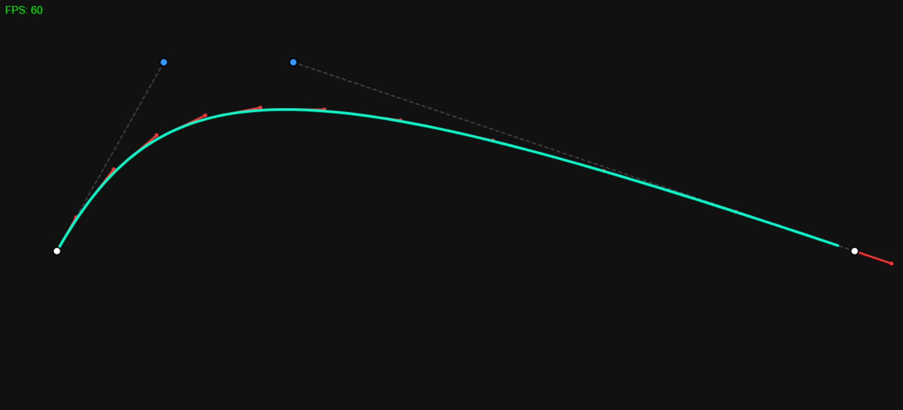

# 🧵 Interactive Bézier Rope Simulation

An **interactive, real-time cubic Bézier curve** that behaves like a **physical rope** using custom spring–damper physics.
Built with **vanilla JavaScript + HTML5 Canvas**, this project focuses on **math correctness, physics realism, and performance stability (~60 FPS)** across desktop and mobile devices.

---

## 📸 Visual Preview



> The rope responds smoothly to mouse and touch input with natural lag, overshoot, and damping — closely mimicking real rope behavior.

---

## 🚀 Features

* 🎯 **Real-time cubic Bézier curve rendering**
* 🧠 **Analytical Bézier evaluation (Bernstein Polynomials)**
* 🛠 **Spring–damper physics** for rope-like motion
* 📐 **Exact tangent (derivative) visualization**
* 🖱 **Mouse + multi-touch support**
* ⚡ **Garbage-free animation loop**
* 📊 **Live FPS counter**
* 📱 **Responsive & mobile-friendly**

---

## 🧠 Mathematical Foundation

### Cubic Bézier Curve (Analytical Form)

The rope is rendered using the explicit cubic Bézier equation:

```
B(t) = (1 − t)³ P₀
     + 3(1 − t)² t P₁
     + 3(1 − t) t² P₂
     + t³ P₃
```

**Why analytical evaluation?**

* Constant-time computation per sample
* No recursive interpolation
* Better suited for real-time animation
* Minimal temporary object creation

The curve is sampled at `t += 0.01` to ensure smooth rendering.

---

## 📐 Tangent & Derivative Visualization

Tangents are calculated using the **exact first derivative** of the cubic Bézier curve:

```
B'(t) = 3(1 − t)² (P₁ − P₀)
      + 6(1 − t) t (P₂ − P₁)
      + 3 t² (P₃ − P₂)
```

### Why this matters

* Mathematically correct direction vectors
* Useful for debugging curve shape
* Demonstrates Bézier calculus understanding

Tangents are normalized and rendered as **red directional vectors** along the curve.

---

## 🛠 Physics Model – Spring–Damper System

The inner control points **P₁** and **P₂** do not snap to the cursor.
Instead, they follow a **Hooke-inspired spring equation**:

```
a = −k(x − x_target)
v = v · damping
x = x + v
```

### Parameters

* **Spring stiffness (k):** `0.05`
* **Damping:** `0.90`

### Resulting Motion

* Natural lag
* Smooth overshoot
* Gradual settling
* Stable equilibrium when input stops

Euler integration is used for simplicity and performance.

---

## 🎮 Interaction Controls

* **Mouse Move:** Pull the rope (desktop)
* **Automatic hover mode:** Rope follows cursor even without dragging

The rope endpoints (**P₀** and **P₃**) remain anchored, while the middle control points respond dynamically.

---

## ⚡ Performance Optimizations

* ✅ No object allocation inside the animation loop
* ✅ Predefined vector math helpers
* ✅ Single `requestAnimationFrame` loop
* ✅ Canvas cleared efficiently per frame
* ✅ No expensive filters (`shadowBlur` avoided)

Result: **Stable ~60 FPS** on modern desktop and mobile browsers.

---

## 🗂 Project Structure

```
📦 Interactive-Bezier-Rope
├── index.html
├── image.png
├── css/
│   └── style.css
└── js/
    ├── math.js      // Vector math + Bézier math
    ├── physics.js   // Spring–damper physics
    ├── input.js     // Mouse & touch input handling
    ├── render.js    // Drawing utilities
    └── main.js      // Main loop & orchestration
```

Each file has **single responsibility**, making the system easy to read, debug, and extend.

---

## 🧪 Learning Outcomes

This project demonstrates:

* Strong grasp of **Bézier curve mathematics**
* Practical **real-time physics simulation**
* Performance-aware **render loop design**
* Clean modular JavaScript architecture
* Mobile-friendly interaction handling

---

## ▶️ Demo Video

🎥 **YouTube Demo:** [https://youtu.be/Id9db0-g5oo](https://www.youtube.com/watch?v=Z3lqvAOFKf4)

The video showcases:

* Real-time curve deformation
* Spring–damper motion
* Tangent visualization
* Live FPS stability

---

## 📌 Future Improvements

* Adjustable stiffness & damping UI sliders
* Multiple rope segments
* Constraint-based rope physics
* WebGL rendering for higher resolution

---

## 📄 License

This project is open for **learning and portfolio use**.

---

✨ *A math-first, performance-driven approach to interactive graphics.*
